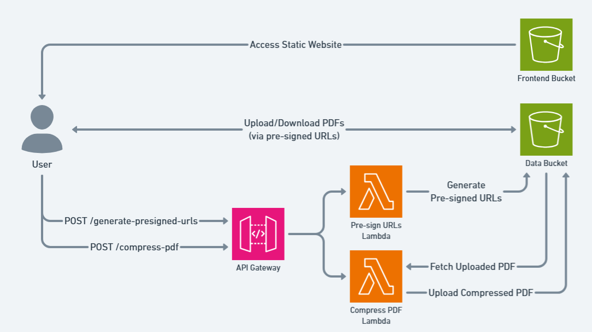
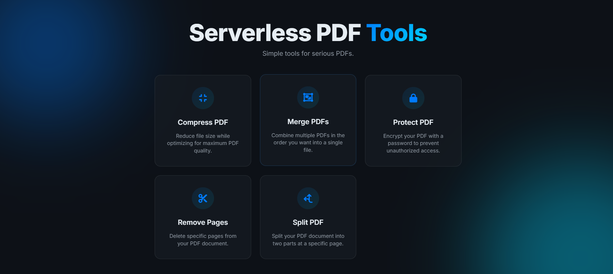

# Serverless-PDF-Tools
A lightweight tool for performing common PDF operations without relying on external SaaS platforms. Deploy it inside your own cloud environment to process documents securely while maintaining full control over your data.

## Highlights
- Compress, split, merge, remove-pages, and password-lock PDFs — all in the browser
- Frontend served via S3 Static Website Hosting
- Backend uses API Gateway + Lambda + S3
- S3 lifecycle rule auto-deletes uploaded and processed PDFs after 1 day
- **Near-zero cost when idle!**

## Architecture

## Screenshots

See more in the [screenshots/](screenshots/) folder.
